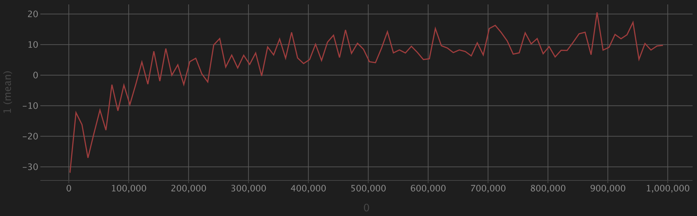

# Training

Average episode reward:

There definitely is room for performance improvement by adjusting hyperparameters. One million time steps might not be sufficient for the model to be robust enough. Applying some tricks might also reduce crashes and improve efficiency.

# Benchmark

Each scenario is randomly generated using the same mechanism in training. This process covers all scenarios and repeats for 100 times. The unit time is also 0.1s, and the maximum time steps is 900.

## Average Crashes

Before:

|    | h0   | h1   | h2   | h3   | h4   | h5   | h6   |
|----|------|------|------|------|------|------|------|
| v1 | 0.00 | 0.32 | 0.31 | 0.19 | 0.38 | 0.24 | 0.28 |
| v2 | 1.66 | 1.80 | 1.70 | 1.67 | 1.68 | 1.61 | 1.75 |
| v3 | 2.28 | 2.47 | 2.50 | 2.59 | 2.55 | 2.43 | 2.56 |
| v4 | 3.54 | 3.52 | 3.64 | 3.71 | 3.61 | 3.64 | 3.66 |
| v5 | 4.45 | 4.60 | 4.58 | 4.63 | 4.58 | 4.63 | 4.55 |
| v6 | 5.56 | 5.62 | 5.66 | 5.62 | 5.65 | 5.60 | 5.58 |
| v7 | 6.51 | 6.62 | 6.69 | 6.59 | 6.56 | 6.67 | 6.66 |

After:

|    | h0   | h1   | h2   | h3   | h4   | h5   | h6   |
|----|------|------|------|------|------|------|------|
| v1 | 0.00 | 0.16 | 0.22 | 0.20 | 0.14 | 0.15 | 0.11 |
| v2 | 0.54 | 0.66 | 0.43 | 0.28 | 0.43 | 0.28 | 0.22 |
| v3 | 0.62 | 0.62 | 0.54 | 0.55 | 0.32 | 0.57 | 0.42 |
| v4 | 1.03 | 1.00 | 0.85 | 0.72 | 0.92 | 0.69 | 0.78 |
| v5 | 1.04 | 0.89 | 0.91 | 0.96 | 1.03 | 0.81 | 0.96 |
| v6 | 1.45 | 1.38 | 1.46 | 1.25 | 1.29 | 1.29 | 1.36 |
| v7 | 1.48 | 1.43 | 1.89 | 1.72 | 1.64 | 1.79 | 1.42 |

The average number of crashes is the most important category, because it relates to safety issues. For this extreme environment, the crash rate reaches 80.2% without the model, but the model can lower the figure to 19.7% while maintaining efficiency.

## Median Steps Taken

Before:

|    | h0   | h1   | h2   | h3   | h4   | h5   | h6   |
|----|------|------|------|------|------|------|------|
| v1 | 16.0 | 16.0 | 16.0 | 16.0 | 16.0 | 16.0 | 16.0 |
| v2 | 9.0  | 9.0  | 9.0  | 9.0  | 9.0  | 9.0  | 9.0  |
| v3 | 16.0 | 9.0  | 9.0  | 9.0  | 9.0  | 12.5 | 9.0  |
| v4 | 9.0  | 9.0  | 9.0  | 9.0  | 9.0  | 9.0  | 9.0  |
| v5 | 9.0  | 9.0  | 9.0  | 9.0  | 9.0  | 9.0  | 9.0  |
| v6 | 9.0  | 9.0  | 9.0  | 9.0  | 9.0  | 9.0  | 9.0  |
| v7 | 9.0  | 9.0  | 9.0  | 9.0  | 9.0  | 9.0  | 9.0  |

After:

|    | h0    | h1    | h2    | h3    | h4    | h5    | h6    |
|----|-------|-------|-------|-------|-------|-------|-------|
| v1 | 16.0  | 16.0  | 16.0  | 24.0  | 64.5  | 69.5  | 103.0 |
| v2 | 38.0  | 35.5  | 48.5  | 78.0  | 102.5 | 156.5 | 164.5 |
| v3 | 53.5  | 65.5  | 94.0  | 129.5 | 187.0 | 184.0 | 215.0 |
| v4 | 71.5  | 89.0  | 142.5 | 182.0 | 173.0 | 214.0 | 258.5 |
| v5 | 90.0  | 123.0 | 171.0 | 199.0 | 220.0 | 277.0 | 265.0 |
| v6 | 125.0 | 165.5 | 210.5 | 204.0 | 259.0 | 259.5 | 283.0 |
| v7 | 167.0 | 190.5 | 219.5 | 260.5 | 272.0 | 313.0 | 334.5 |

The time taken is jointly proportional to the number of vehicles and the number of humans. Since the baseline just lets all vehicles crash into each other, the length of the episode is very short, i.e., it is completed in around 1s. The results are not comparable. However, even for the most complicated case, it only takes about 33s to finish the episode on median, which is still a decent number.

The median value is preferred over the mean value because there exist edge cases that are impossible to complete without crashing. In those cases, the most optimal policy is to stop the vehicles from moving forward all the time. This will lead to very large time steps and failure in completion. Thus, the mean value is not a reasonable representation.

## Average Completion

Before:

|    | h0  | h1  | h2  | h3  | h4  | h5  | h6  |
|----|-----|-----|-----|-----|-----|-----|-----|
| v1 | 1.0 | 1.0 | 1.0 | 1.0 | 1.0 | 1.0 | 1.0 |
| v2 | 1.0 | 1.0 | 1.0 | 1.0 | 1.0 | 1.0 | 1.0 |
| v3 | 1.0 | 1.0 | 1.0 | 1.0 | 1.0 | 1.0 | 1.0 |
| v4 | 1.0 | 1.0 | 1.0 | 1.0 | 1.0 | 1.0 | 1.0 |
| v5 | 1.0 | 1.0 | 1.0 | 1.0 | 1.0 | 1.0 | 1.0 |
| v6 | 1.0 | 1.0 | 1.0 | 1.0 | 1.0 | 1.0 | 1.0 |
| v7 | 1.0 | 1.0 | 1.0 | 1.0 | 1.0 | 1.0 | 1.0 |

After:

|    | h0   | h1   | h2   | h3   | h4   | h5   | h6   |
|----|------|------|------|------|------|------|------|
| v1 | 1.00 | 1.00 | 0.99 | 1.00 | 0.99 | 0.99 | 0.99 |
| v2 | 0.99 | 1.00 | 0.98 | 1.00 | 0.98 | 1.00 | 1.00 |
| v3 | 0.99 | 1.00 | 0.98 | 0.97 | 0.99 | 0.95 | 0.98 |
| v4 | 0.99 | 1.00 | 1.00 | 0.95 | 1.00 | 0.97 | 0.96 |
| v5 | 0.97 | 1.00 | 0.98 | 0.99 | 0.96 | 0.94 | 0.92 |
| v6 | 0.99 | 0.99 | 0.97 | 0.98 | 0.97 | 0.99 | 0.97 |
| v7 | 0.96 | 1.00 | 1.00 | 0.97 | 0.98 | 0.94 | 0.96 |

There is only approximately 1.8% loss in the overall completion rate, which is negligible due to edge cases.
